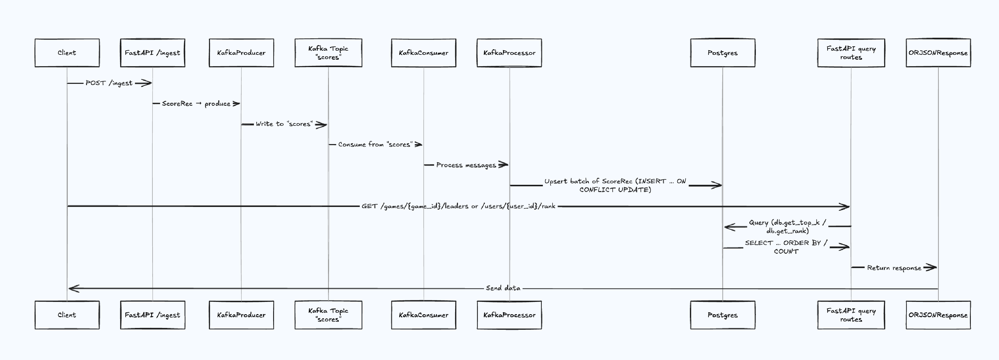

# Leaderboard Service Design

## 1. Data Structures

### PostgreSQL B-Tree Indexes

- Primary index: `(game_id, score DESC)` for Top-K queries
- Secondary index: `(user_id, game_id)` for user lookups

**Complexity Analysis:**

- Insert/Upsert: O(log N)
- Top-K Query: O(log N + K)
- User Score Lookup: O(log N)
- Rank Calculation: O(log N + R)

## 2. Persistence & Recovery

### Kafka

- Replication Factor ≥ 3
- Producer acks=all
- Auto-commit enabled (1s interval)

### PostgreSQL

- WAL enabled
- Synchronous commits
- Connection pooling with asyncpg

### Recovery

- Idempotent upserts via ON CONFLICT
- Health monitoring
- Automated recovery on failures

## Future Improvements

### In-Memory Cache

- SortedList per game: `[(score, user_id)]`
- Operations: O(log M) for insert, O(K) for Top-K, O(log M) for rank lookup

### Redis Sorted Sets Cache

- ZSET per game with key `leaders:{game_id}`
- Operations:
  - ZADD: O(log M)
  - ZREVRANGE: O(log M + K)
  - ZREVRANK: O(log M)
  - ZCARD: O(1)
- Write-through consistency
- TTL/LRU eviction policy

### Enhanced Caching Strategy

- Redis Cluster with key hashing
- Kafka partitioning by game_id hash
- DB sharding with lookup service
- In-memory Python cache for hot games
