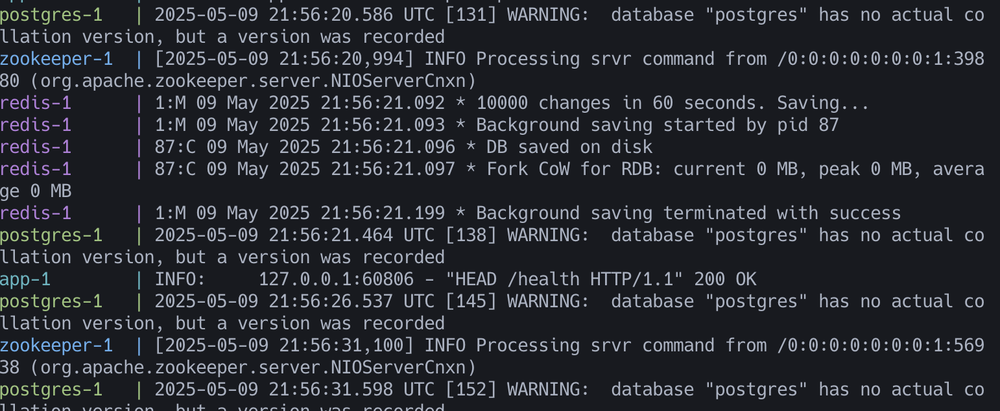
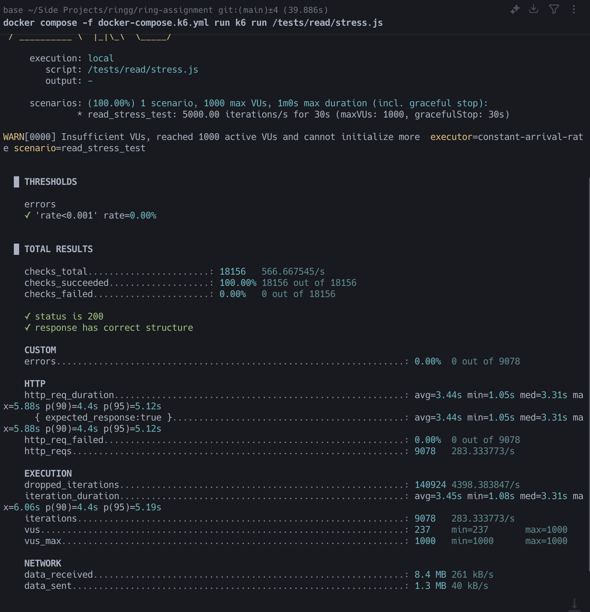
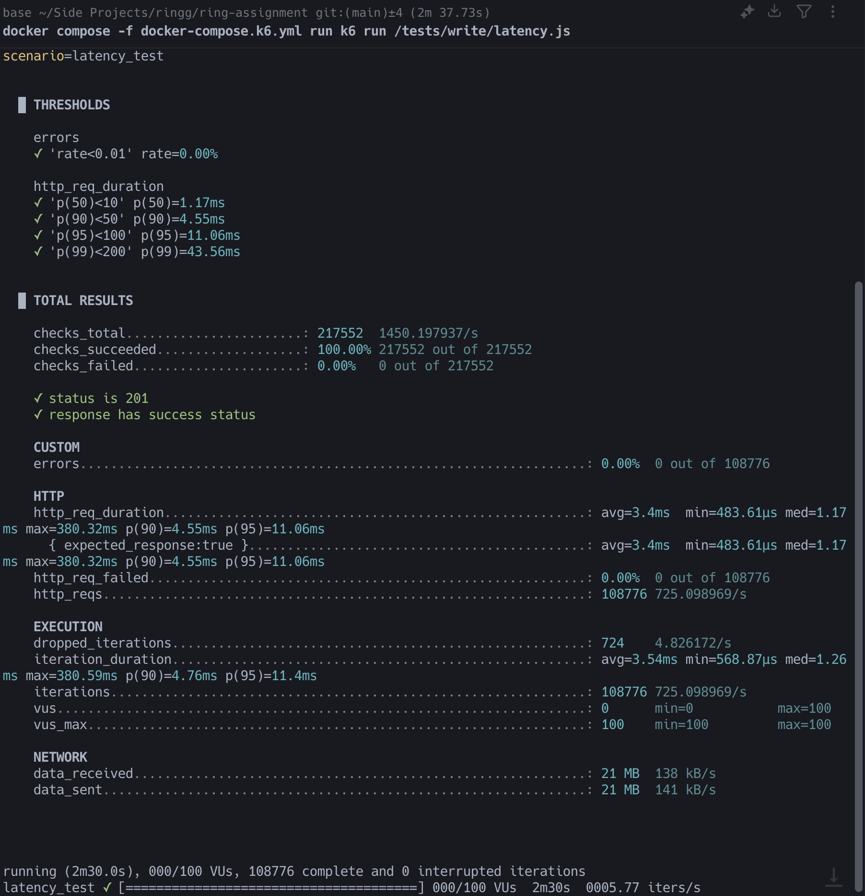

# Ring Assignment

A Python-based application with Docker support and performance testing capabilities using k6.

## Prerequisites

- Python 3.x
- Poetry (Python package manager)
- Docker and Docker Compose
- k6 (for performance testing)

## Project Structure

```
.
├── app/                    # Main application code
├── tests/                  # Test files
├── docker-compose.dev.yml  # Development Docker configuration
├── docker-compose.k6.yml   # k6 performance testing configuration
├── Dockerfile.mac         # Docker configuration for Mac
├── Dockerfile.k6          # k6 Docker configuration
├── k6.yml                 # k6 test configuration
└── pyproject.toml         # Poetry project configuration
```

## Getting Started

1. Install dependencies using Poetry:

   ```bash
   poetry install
   ```

2. Run the application in development mode:

   ```bash
   docker-compose -f docker-compose.dev.yml up --build
   ```

   Note: Please wait for approximately 3 minutes for all services to initialize completely.

   After sucessful initialization, the logs will look something like this

   

3. Access the API documentation:
   The Swagger UI documentation will be available at

```bash
http://localhost:8000/docs
```

## Performance Testing

### Read Endpoints (Top-k)

Run latency tests:

```bash
docker-compose -f docker-compose.k6.yml run k6 run /tests/read/latency.js
```

Run stress tests:

```bash
docker-compose -f docker-compose.k6.yml run k6 run /tests/read/stress.js
```

### Write Endpoints (Ingest)

Run latency tests:

```bash
docker-compose -f docker-compose.k6.yml run k6 run /tests/write/latency.js
```

Run stress tests:

```bash
docker-compose -f docker-compose.k6.yml run k6 run /tests/write/stress.js
```

## Test Results



